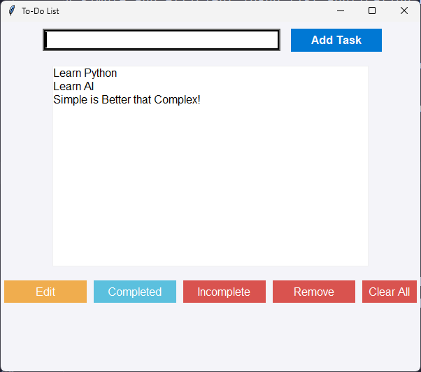

# To-Do List App

A simple and efficient To-Do list application built with Python and SQLite, using a graphical user interface (GUI) made with `tkinter`.

## Features
- Add, edit, remove, and mark tasks as completed or incomplete.
- Tasks are stored in a local SQLite database.
- User-friendly interface with responsive layout.

## Screenshots


## Requirements

- Python 3.x
- `tkinter` (Usually comes pre-installed with Python)
- `sqlite3` (Usually comes pre-installed with Python)

## Installation

1. Clone the repository to your local machine:

    ```bash
    git clone https://github.com/your-username/todo-app.git
    cd todo-app
    ```

2. Install the required Python libraries:

    ```bash
    pip install -r requirements.txt
    ```

    > **Note:** If you don't have `requirements.txt`, ensure you have Python 3.x installed, as `tkinter` and `sqlite3` are part of the standard Python library.

3. Run the app:

    ```bash
    python main.py
    ```

   This will launch the To-Do list app with a GUI where you can start adding, editing, and managing your tasks.

## Usage

1. **Add Task**: Enter a task in the input field and press "Enter" or click "Add Task".
2. **Edit Task**: Select a task from the list and click "Edit", then update the task.
3. **Mark as Completed**: Select a task and click "Completed" to mark it as completed (a check mark will appear).
4. **Mark as Incomplete**: Select a completed task and click "Incomplete" to unmark it.
5. **Remove Task**: Select a task and click "Remove" to delete it from the list.
6. **Clear All Tasks**: Click "Clear All" to remove all tasks from the list.

## Building the Executable (Optional)

If you want to create a standalone executable file for your app, you can use **PyInstaller**. This will bundle your application into a single file that can run on Windows, macOS, or Linux without requiring Python to be installed.

### Steps to Build an Executable:

1. Install PyInstaller:

    ```bash
    pip install pyinstaller
    ```

2. Use the following command to create a standalone executable:

    ```bash
    pyinstaller --onefile --noconsole main.py
    ```

    This will generate a `dist/` folder containing the executable. The `--noconsole` flag ensures that the terminal window does not appear when you run the app.

3. Navigate to the `dist` folder and run the `.exe` (on Windows) or the app on other systems.

## Contributing

Feel free to fork the repository, create a new branch, and submit a pull request with your improvements or bug fixes.

1. Fork the repository.
2. Create your feature branch: `git checkout -b feature-branch`.
3. Commit your changes: `git commit -am 'Add new feature'`.
4. Push to the branch: `git push origin feature-branch`.
5. Create a new pull request.

## License

This project is open-source and available under the [MIT License](LICENSE).

## Contact

- Author: Wpstorm Genius
- GitHub: [Your GitHub Profile](https://github.com/esradev/)
- Email: wpstormdev@gamin.com
